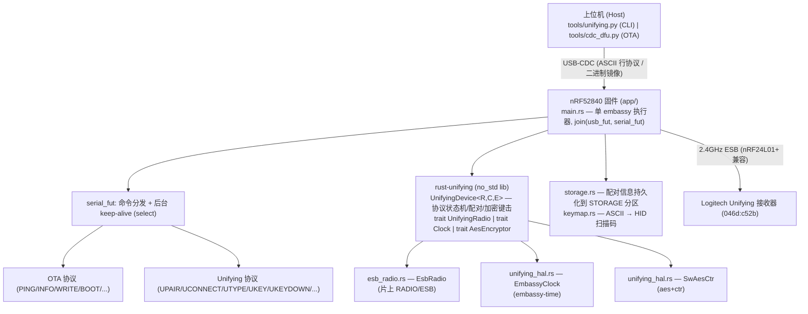
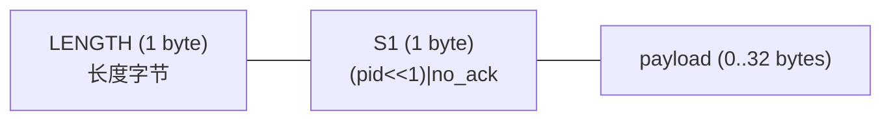
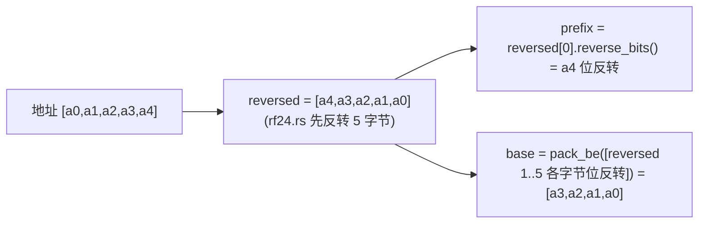

# 技术文档 —— nRF52840 优联键盘发射器

本文详细说明当前项目的架构与实现:nRF52840 用片上原生 2.4GHz 射频(ESB 模式)模拟一个 Logitech Unifying 无线键盘,通过 USB-CDC 串口接收上位机命令,并保留 CDC OTA 升级能力。

---

## 1. 总体架构



设计原则:**协议逻辑硬件无关**。`rust-unifying` 把全部 Unifying 协议(配对握手、AES 密钥派生、加密键击、保活、HID++ 应答)封装在 `UnifyingDevice` 里,只通过三个 trait 触及硬件。本次移植的核心工作就是为 nRF52840 实现这三个 trait,其中绝大部分是 `UnifyingRadio`。

---

## 2. 工程结构

```
nrf52-rs-scaffold/
├── app/                         # 应用固件 (运行在 ACTIVE 分区)
│   ├── src/
│   │   ├── main.rs              # 入口、USB-CDC、命令分发、保活循环
│   │   ├── esb_radio.rs         # UnifyingRadio 在片上 RADIO 上的实现
│   │   ├── unifying_hal.rs      # Clock + AesEncryptor 实现
│   │   ├── keymap.rs            # ASCII → USB HID 扫描码
│   │   └── storage.rs           # 配对信息持久化 (STORAGE 分区)
│   ├── memory.x                 # 分区链接脚本
│   └── Cargo.toml
├── bootloader/                  # embassy-boot bootloader
├── tools/
│   ├── cdc_dfu.py               # Linux OTA 升级脚本
│   ├── cdc_dfu.ps1              # Windows OTA 升级脚本
│   └── unifying.py              # 上位机操作 CLI
└── docs/

rust-unifying/rust-unifying/     # 协议库 (path 依赖, no_std)
├── src/
│   ├── device.rs                # UnifyingDevice 状态机
│   ├── radio.rs                 # trait UnifyingRadio
│   ├── crypto.rs                # trait AesEncryptor
│   ├── payload.rs               # Unifying 报文编解码
│   └── constants.rs             # 协议常量 (信道表/地址/AES 掩码)
```

---

## 3. 协议库 rust-unifying

### 3.1 三个硬件抽象 trait

```rust
// 射频:全部空中收发的抽象
pub trait UnifyingRadio {
    type Error;
    fn configure_unifying(&mut self) -> Result<(), Self::Error>;
    fn transmit_payload(&mut self, payload: &[u8]) -> Result<bool, Self::Error>;
    fn receive_payload(&mut self, payload: &mut [u8]) -> Result<u8, Self::Error>;
    fn payload_available(&mut self) -> Result<bool, Self::Error>;
    fn payload_size(&mut self) -> Result<u8, Self::Error>;
    fn set_address(&mut self, address: &[u8; ADDRESS_LEN]) -> Result<(), Self::Error>;
    fn set_channel(&mut self, channel: u8) -> Result<(), Self::Error>;
    fn set_retries(&mut self, delay: u8, count: u8) -> Result<(), Self::Error>;
}

pub trait Clock { fn millis(&mut self) -> u32; }

pub trait AesEncryptor {
    type Error;
    fn encrypt(&mut self, data: &mut [u8; AES_DATA_LEN],
               key: &[u8; AES_BLOCK_LEN], iv: &[u8; AES_BLOCK_LEN])
        -> Result<(), Self::Error>;
}
```

`transmit_payload` 返回 `bool`,表示该帧是否被接收机 ACK——这是上层判断链路是否在线的关键信号。

### 3.2 UnifyingDevice 状态机

`UnifyingDevice<R, C, E, TX_CAP, RX_CAP>` 持有 radio/clock/encryptor 三件硬件以及连接态:

| 字段 | 含义 |
| --- | --- |
| `address: [u8; 5]` | 当前设备地址(配对后由接收机分配) |
| `aes_key: [u8; 16]` | 配对握手中派生的 AES-128 密钥 |
| `aes_counter: u32` | 加密键击计数器,防重放,每次键击自增 |
| `channel: u8` | 当前 RF 信道(2400+channel MHz) |
| `timeout` / `default_timeout` | 保活超时,影响 keep-alive 节奏 |
| `tx_queue` / `rx_queue` | heapless 发送/接收队列 |

关键方法:

- `configure_radio()`:调用 `UnifyingRadio::configure_unifying` + 设地址/信道。
- `pair(params)`:完整三步配对握手 + complete,成功后派生 `aes_key`、更新 `address`。
- `connect()`:发 wake-up 包扫遍信道表,重新锁定接收机当前信道。
- `send_encrypted_keystroke(keys, modifiers)`:AES-CTR 加密 8 字节明文(modifier + 6 键码 + 0xC9),封帧,同步发送,自增 counter。
- `tick()`:核心保活。内部用 `transmit_due()` 判断保活窗口是否到期;到期则发 keep-alive(或发 HID++ 应答/队列里的报文);未到期是空操作。
- `queue_mouse()`:鼠标报文入队(当前未在固件层使用)。

`tick()` 的语义很重要:它**不是无条件发包**,而是受 `previous_transmit`/`next_transmit` 时间窗口约束。所以固件可以高频调用它(每 8ms)而不会刷爆射频——只在窗口到期时才真正发一帧保活。

### 3.3 报文与加密

- 校验和:`checksum = 0 - Σbytes`(逐字节 wrapping_sub),末字节为校验。
- 加密键击明文:`[modifier, k0..k5, 0xC9]`,共 8 字节。
- IV:`AES_NONCE_PREFIX(7) + counter_be(4) + AES_NONCE_SUFFIX(5)`,共 16 字节。
- AES-128-CTR 对 8 字节明文做 keystream XOR。
- AES 密钥派生:配对握手拿到双方 product_id/crypto/serial 后,按固定的 `AES_KEY_INDEX` 重排 + `AES_KEY_BITMASK` 异或取反生成 16 字节密钥。

### 3.4 no_std 化改造

库原本依赖 `rppal`(树莓派 GPIO)和 `rf24-rs`。改造后这些依赖全部 gate 到 `rf24` feature 之后,`aes`/`ctr`/`heapless` 都加 `default-features = false`,使库能以 `no_std` 编入固件:

```toml
[features]
default = []
rf24 = ["dep:rf24", "dep:rppal", "dep:embedded-hal", "dep:embedded-hal-bus"]
```

固件以 `default-features = false` 引用,只拿协议逻辑。

---

## 4. 核心:EsbRadio —— 片上 RADIO 的 ESB 实现

`app/src/esb_radio.rs`。这是整个移植的技术核心:把 nRF52840 的片上 2.4GHz RADIO 外设配置成与 nRF24L01+ 字节级兼容的 ESB,替代外接 SPI 射频模块。

### 4.1 为什么能行

Logitech Unifying 的空中协议就是 Nordic Enhanced ShockBurst(ESB),也就是 nRF24L01+ 用的协议。nRF52840 的 RADIO 外设可配置成同样的包格式、调制、CRC,因此能直接和接收机通信。

### 4.2 射频寄存器配置

`configure_unifying()` 通过 embassy 的 `pac::RADIO` 直接写寄存器,配置参照成熟的 `esb` crate(实测可与真实 nRF24L01+ 互通):

| 寄存器 | 配置 | 说明 |
| --- | --- | --- |
| `MODE` | `NRF_2MBIT` | 2Mbit Nordic 私有模式(Unifying 速率) |
| `MODECNF0` | `RU=FAST, DTX=CENTER` | 快速 ramp-up,保证 TX→RX 转向在 ACK 窗口内 |
| `TXPOWER` | `POS8_DBM` | +8dBm 发射功率 |
| `PCNF0` | `LFLEN=6, S0LEN=0, S1LEN=3` | 6-bit 长度字段 + 3-bit S1(PID+no_ack),无 S0 |
| `PCNF1` | `MAXLEN=32, BALEN=4, ENDIAN=BIG, WHITEEN=0` | 动态长度,4 字节 base + 1 字节 prefix = 5 字节地址,大端,关白化 |
| `CRCCNF` | `LEN=TWO, SKIPADDR=INCLUDE` | CRC-16,地址参与 CRC |
| `CRCPOLY` | `0x11021` | CRC-16 多项式 |
| `CRCINIT` | `0xFFFF` | CRC 初值 |

### 4.3 DMA 包格式

ESB 在 nRF52 上的 DMA 缓冲布局(对应 LFLEN=6 / S1LEN=3):



固件用 `tx_buf[0]=len, tx_buf[1]=(pid<<1)|1, tx_buf[2..]=payload`。`pid` 是 2-bit 包序号,每发一个**新**包自增(重传保持同一 pid)。`no_ack` 恒为 1(请求 ACK)。

### 4.4 地址编码(关键)

nRF24L01+ 在硬件中对地址做位反转,nRF52 必须在软件中补上。同时 nRF24 的 `TX_ADDR` 寄存器布局与 nRF52 的 BASE0/PREFIX0 拆分方式不同,字节序需要对齐。

`hw_address(address, encoding)` 内置 4 种候选编码以便用 `URADIOTEST` 扫频定位。**实测确定的正确编码是 encoding=1**(已设为默认):



每个字节都做 `reverse_bits()`(对应 nRF24L01+ 的硬件位序),base 以大端打包到 BASE0,prefix 写入 PREFIX0.AP0。逻辑地址固定用 pipe 0。

### 4.5 收发时序(阻塞式 PTX)

`tx_once()` 全序列化,避免硬件 shortcut 转向的竞态:

```mermaid
graph LR
    subgraph "1. 发送"
        txen --> READY1[READY] -->|short| START1[START] --> TX[发包] --> END1[END] -->|short| DISABLE1[DISABLE]
    end
    subgraph "2. 等 DISABLED"
        WAIT1[等待 DISABLED 事件]
    end
    subgraph "3. 收 ACK"
        rxen --> READY2[READY] -->|short| START2[START] --> RX[收ACK] --> END2[END] -->|short| DISABLE2[DISABLE]
    end
    subgraph "4. 等 END 或超时"
        WAIT2["等 END (或超时 ACK_WAIT_US=600μs)"]
    end
    subgraph "5. 校验"
        CHECK["校验 CRC, 提取 ACK payload (若有)"]
    end

    DISABLE1 --> WAIT1 --> rxen
    DISABLE2 --> WAIT2 --> CHECK
```



时间余量:接收机回 ACK 约 130μs,快速 ramp-up 约 40μs,600μs 窗口足够覆盖转向 + 32 字节 ACK payload(2Mbit/s)。

`transmit_payload()` 在 `tx_once()` 失败时按 `retransmit_count`(默认 15)做软件重传,重传间隔 `retransmit_delay × 250μs`(上限 1500μs,防止发送失败时长时间饿死 USB 任务)。

ACK 计时用 DWT cycle counter(64MHz,1 cycle ≈ 1/64 μs),在 `new()` 里 steal DWT/DCB 启用(embassy 不用这两个单元)。

### 4.6 信道

`set_channel(ch)` 直接写 `FREQUENCY = ch`(0..100)。Unifying 的"信道"就是 2400+ch MHz 的偏移,与 nRF52 FREQUENCY 寄存器值一一对应。

---

## 5. Clock 与 AesEncryptor

`app/src/unifying_hal.rs`,两个轻量胶水实现:

```rust
// 毫秒时钟:基于 embassy 单调定时器
impl Clock for EmbassyClock {
    fn millis(&mut self) -> u32 {
        Instant::now().duration_since(self.start).as_millis() as u32
    }
}

// AES-128-CTR:aes + ctr crate
type Aes128Ctr = ctr::Ctr128BE<Aes128>;
impl AesEncryptor for SwAesCtr {
    fn encrypt(&mut self, data, key, iv) -> Result<(), Infallible> {
        Aes128Ctr::new(key.into(), iv.into()).apply_keystream(data);
        Ok(())
    }
}
```

---

## 6. 主程序与命令分发

`app/src/main.rs`。单 embassy 执行器,`join(usb_fut, serial_fut)` 并发跑 USB 协议栈和串口处理。

### 6.1 启动流程

```rust
1. embassy_nrf::init
2. 启动 HFCLK(USB 与 RADIO 都需要)
3. 建立 USB-CDC ACM (VID:PID = 1209:0001)
4. FirmwareUpdater:若处于 Swap/Revert 态,mark_booted() 确认本次启动
5. UnifyingState::new() + storage::load() 恢复持久化配对
6. join(usb.run(), serial_fut)
```

### 6.2 保活循环(核心)

串口内层循环不是简单的阻塞读,而是在已连接态下用 `select` 把保活穿插进等待:

```rust
let n = if unifying.connected && !upload_active {
    match select(
        class.read_packet(&mut packet),
        Timer::after(Duration::from_millis(8)),
    ).await {
        Either::First(Ok(n)) => n,              // 收到命令
        Either::First(Err(_)) => break,         // 断开
        Either::Second(_) => {                  // 8ms 到,保活
            let _ = unifying.device.tick();
            continue;
        }
    }
} else {
    // 未连接或 OTA 上传中:纯阻塞读
    class.read_packet(&mut packet).await?
};
```

这是整个系统稳定的关键。Unifying 连接靠持续 keep-alive 维持跳频同步;若命令之间设备停在阻塞读上不发包,接收机几秒后判定掉线,后续键击全失败。`tick()` 内部自带保活窗口判断,每 8ms 调一次大多是空操作,到期才发一帧,正好复刻真实键盘节奏。

### 6.3 OTA 协议(保留)

ASCII 行命令,`\n` 结尾。与原脚手架字节级兼容:

| 命令 | 行为 | 回复 |
| --- | --- | --- |
| `PING` | 探活 | `PONG` |
| `INFO` | bootloader 状态 + build | `STATE BOOT BUILD=...` |
| `WRITE <size>` | 进入镜像接收态 | `READY` |
| (二进制) | 写入 DFU 分区 | `OK` |
| `BOOT` | mark_updated + 复位 | `REBOOT` |
| `ABORT` / `REBOOT` | 中止 / 立即复位 | `ABORTED` / `REBOOT` |

镜像以 4 字节对齐分块写入 DFU 分区,尾部不足 4 字节用 0xFF 补齐。

### 6.4 Unifying 命令

| 命令 | 行为 | 回复 |
| --- | --- | --- |
| `VER` | 协议版本 + build | `VER unifying/1 build=...` |
| `UPAIR <slot>` | 与配对模式的接收机配对(重试 8 轮),保存到指定 slot(0-3) | `PAIRED <addr-hex> CH=<n>` / `ERR PAIR` |
| `UCONNECT` | 用已存配对唤醒/连接(重试 60 次) | `CONNECTED CH=<n>` / `ERR CONNECT` |
| `USWITCH <slot>` | 切换到指定 profile slot(0-3),加载配对并自动连接 | `SWITCHED <slot> CONNECTED` / `SWITCHED <slot> NOCONN` |
| `UTYPE <text>` | 把文本逐字符当键击发送,保存递增 counter | `TYPED <ok>/<total>` |
| `UKEY <mod> [keys...]` | 发一帧原始 HID(modifier + 至多 6 个 hex 键码)再释放 | `OK` / `ERR SEND` |
| `UKEYDOWN <mod> [keys...]` | 只发按下报文(不自动释放)。用于 KVM 状态式转发 | `OK` / `ERR SEND` |
| `UKEEPALIVE` | 手动发一次保活 | `TICK` |
| `USTATUS` | 状态报告 | `STATUS PAIRED=.. CONN=.. CH=.. CNT=..` |
| `UDELETE <slot>` | 擦除指定 slot 的配对信息 | `DELETED` |
| 未知 | 命令列表 | `UCMDS: ...` |

`UTYPE`/`UKEY` 发送前先 `tick()` 几次稳定链路;`type_char`/`send_key_report` 做 press → release 两帧,内层 `press_key` 对每帧重试至多 20 次(失败时换信道)。

`UKEYDOWN` 只发按下报文(不发释放),适用于 KVM 等需要状态式转发的场景。每次调用发送当前完整 HID 状态(modifier + keys),由调用方负责发送全零帧释放。`UKEYDOWN` 每 128 帧自动持久化一次 AES counter(见下文)。

---

## 7. 持久化存储

`app/src/storage.rs`。配对信息存入 STORAGE 分区(`0xF8000`,32K),使配对在复位/OTA 后存活。支持 4 个独立 profile slot,每个 slot 占一页 flash。

### 7.1 记录格式(32 字节,4 字节对齐)

```
[0..4]   magic = 0x5546_4B31 ("UFK1")
[4..9]   address[5]
[9]      channel
[10..12] reserved
[12..28] aes_key[16]
[28..32] aes_counter (u32 小端)
```

### 7.2 Flash 布局(多 Profile)

| 页 | 地址 | 用途 |
| --- | --- | --- |
| Page 0 | `0xF8000` | Profile slot 0(追加日志,128 条记录) |
| Page 1 | `0xF9000` | Profile slot 1 |
| Page 2 | `0xFA000` | Profile slot 2 |
| Page 3 | `0xFB000` | Profile slot 3 |
| Page 4 | `0xFC000` | Active-slot metadata(追加日志,1024 条 4 字节记录) |
| Pages 5-7 | `0xFD000`-`0xFF000` | Reserved |

每个 profile slot 页为独立的追加式日志(4K / 32B = 128 个槽位)。Active-slot metadata 页记录当前活跃 slot 编号(4K / 4B = 1024 条),写满才擦页重来。

### 7.3 追加式日志(降低 flash 磨损)

每个 slot 页 4K 分为 128 个 32 字节槽位。每次 `save()` 追加一条记录到第一个空槽(擦除后的 flash 读作 `0xFFFFFFFF`,与 magic 不同,易于判空);写满 128 槽才擦整页重来。`load()` 顺序扫描,返回最后一条有效记录。`clear()` 擦整页(UDELETE)。

### 7.4 AES counter 的安全性

`aes_counter` 是接收机的防重放计数,**复位后必须续用更大的值**,否则键击因"counter 已见过"被拒。因此:

- `UPAIR` 成功后保存完整 profile。
- 每次 `UTYPE`/`UKEY` 后保存递增后的 counter。
- `UKEYDOWN` 每 128 帧(counter & 0x7F == 0)自动持久化一次。

`UnifyingDevice` 的 `aes_counter` 字段语义是"下一个要用的值",所以保存它、重启赋回,永不重用。

### 7.5 flash 句柄共享

STORAGE 与固件更新器复用同一个 `Mutex<NoopRawMutex, RefCell<Nvmc>>`。单 embassy 执行器顺序访问,`.lock()` 不会嵌套,安全。STORAGE 分区在更新器管辖的 DFU/STATE 分区之外,互不干扰。Nvmc 使用**绝对地址**(`0xF8000`),写需 4 字节对齐,擦需页对齐。

---

## AES Counter 保护机制

AES counter 的持久化采用三重保护,确保断电、异常复位等场景下 counter 永远不会回退:

### 启动前跳 +512

每次从 flash 加载 counter 后立即加 512 并写回。覆盖断电前未持久化的增量。接收器接受任何严格大于已见值的 counter(无上限窗口),所以跳过 512 无害。

### 周期存储

`UKEYDOWN` 每 128 帧(counter & 0x7F == 0)自动持久化一次。正常打字约每 10-30 秒触发一次写入。`UTYPE`/`UKEY` 在 burst 结束后保存。

### 掉电紧急存储(POFCON)

启动时启用 nRF52840 POWER.POFCON(阈值 2.7V)。保活 tick 每 8ms 检查 `events_pofwarn`,检测到则紧急写入当前 counter。USB 拔线时 VDD 从 3.3V 下降,板上电容提供几百μs 窗口,够写一条 32 字节记录(~330μs)。

### 最坏情况

即使 POFWARN 也没来得及(如瞬间短路),启动时 +512 已覆盖。对 u32(40 亿)而言 512 的损耗完全可忽略。

---

## 8. Flash 分区布局

`app/memory.x`(nRF52840,1MiB flash):

| 分区 | 起始 | 大小 | 作用 |
| --- | --- | --- | --- |
| BOOTLOADER | `0x00000` | 24K | embassy-boot bootloader |
| BOOTLOADER_STATE | `0x06000` | 4K | 升级状态页 |
| ACTIVE (FLASH) | `0x07000` | 480K | 当前 app(链接地址) |
| DFU | `0x7F000` | 484K | 待升级镜像 |
| STORAGE | `0xF8000` | 32K | 配对持久化 |
| RAM | `0x20000000` | 256K | |

---

## 9. 工具链与构建

- target:`thumbv7em-none-eabihf`(`.cargo/config.toml` 已配置,链接 `link.x`)。
- 依赖锁定:`fixed` 锁到 1.29.0(新版要求更高 rustc)。
- 构建:`cargo build -p nrf-demo-app --release`。
- 导出 OTA 镜像:`llvm-objcopy -O binary <elf> app.bin`(原始二进制,非 elf/hex/uf2)。
- 首刷:需 SWD(`probe-rs download`),先 bootloader 后 app;之后纯 CDC OTA。

---

## 10. USB 设备标识

- VID:PID = `1209:0001`(pid.codes 测试 PID)
- Product = `nRF52840 Unifying CDC`
- Linux 下枚举为 `/dev/ttyACM0`(CDC ACM)
